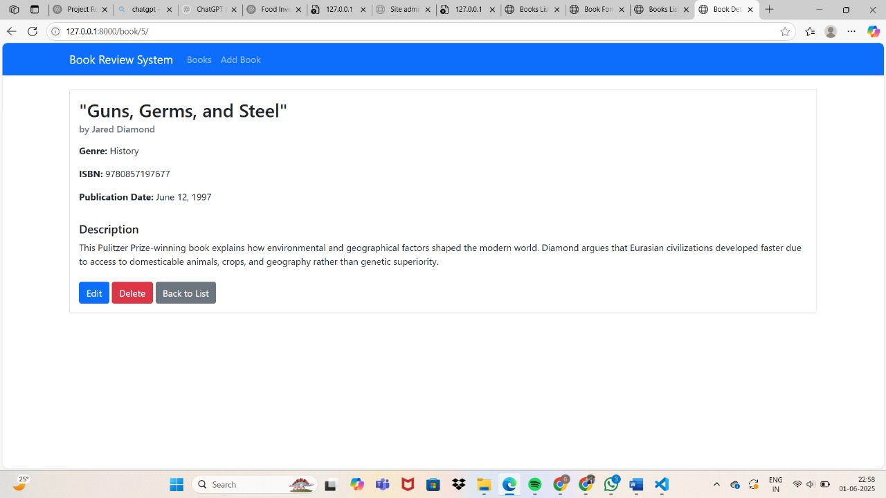
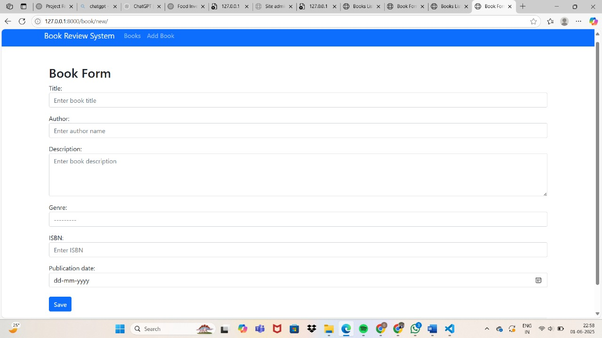
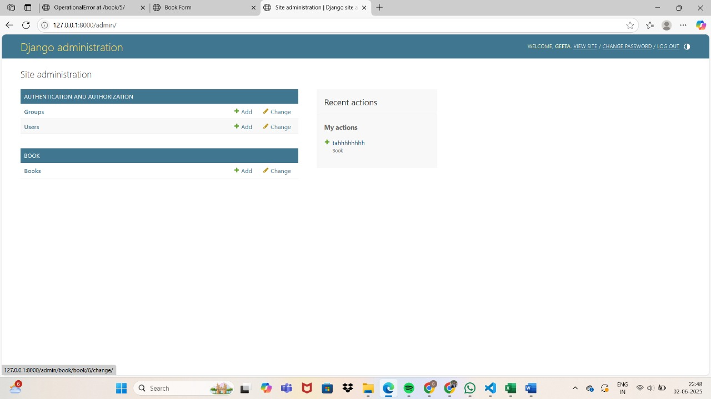
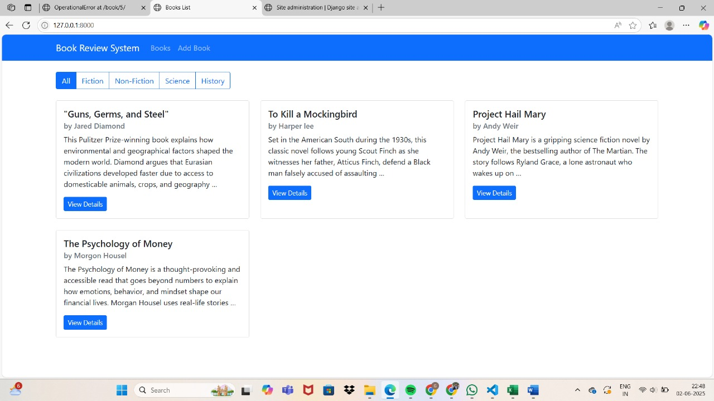

# Book Review System (Django)

A full-stack web application built using Django that allows users to manage books, search for titles, read descriptions, and maintain a structured book review system.

##  Overview

This Book Review System is designed to provide a simple and interactive platform where users can:

- Browse a collection of books  
- Add new books with detailed information  
- View complete book details  
- Search and filter books by category  
- Manage book data through an admin interface  

The project demonstrates core backend development concepts using Django, including CRUD operations, database management, and template rendering.

##  Features

- 📖 View list of books with categories (Fiction, Non-Fiction, Science, History)  
- 🔍 Search and filter books  
- ➕ Add new books using a form  
- 📝 View detailed information (title, author, ISBN, description, publication date)  
- ✏️ Edit and delete books  
- ⚙️ Admin panel for backend management  
- ⭐ Basic structure for rating/review system  

##  Tech Stack

- **Backend:** Django (Python)  
- **Frontend:** HTML, CSS, Bootstrap  
- **Database:** SQLite (default Django DB)  

# Screenshots

